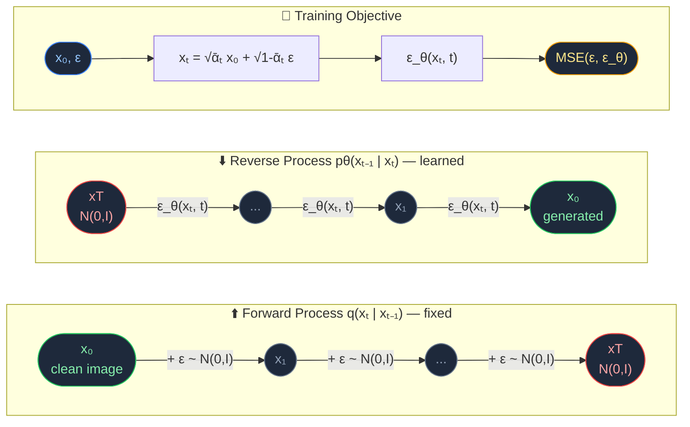
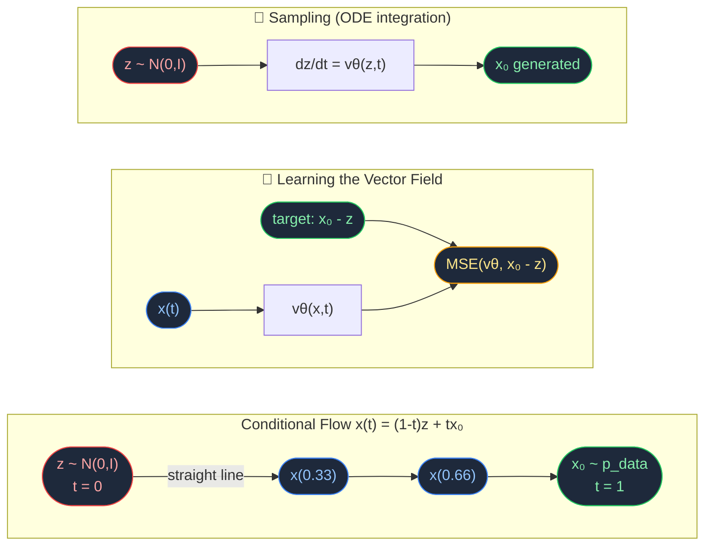
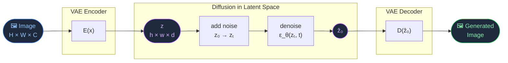
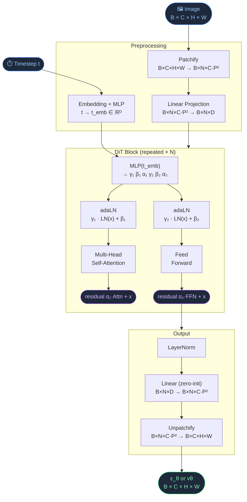

# Diffusion Models from Scratch

PyTorch implementations of DDPM, Flow Matching, and Latent Diffusion built around a custom Diffusion Transformer (DiT) backbone.

| File | Description |
|------|-------------|
| `Diffusion.ipynb` | Training + sampling for all three paradigms |
| `Diffusion_Transformer.py` | Full DiT architecture from scratch |

**Stack:** Python · PyTorch · einops

---

## DDPM



---

## Flow Matching



---

## Latent Diffusion



Diffusion runs in a compressed latent space — much cheaper than pixel space — then the decoder reconstructs the final image.

---

## DiT Architecture



The `α`, `β`, `γ` modulation params are zero-initialized so each block starts as an identity — stable early in training.

---

## Setup

```bash
pip install -r requirements.txt
jupyter notebook Diffusion.ipynb
```
